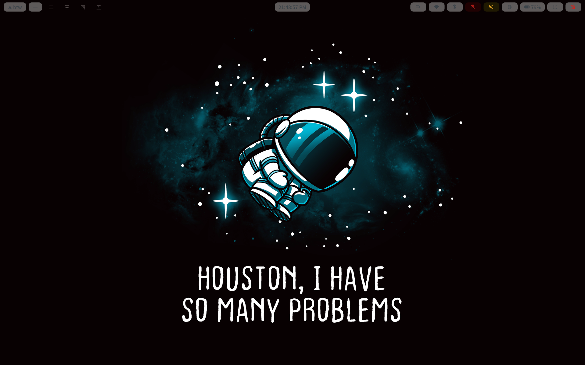

# dotfiles

My personal Hyprland rice — Wayland desktop config for Arch Linux.

## Screenshots

<!-- Add screenshots here, e.g. -->
<!--  -->

## Stack

| Component      | Tool |
|----------------|------|
| Compositor     | [Hyprland](https://hyprland.org/) |
| Bar            | [Waybar](https://github.com/Alexays/Waybar) |
| Launcher       | [Wofi](https://hg.sr.ht/~scoopta/wofi) |
| Notifications  | [SwayNC](https://github.com/ErikReider/SwayNotificationCenter) |
| Logout menu    | [wlogout](https://github.com/ArtsyMacaw/wlogout) |
| Idle/lock      | hypridle + hyprlock |
| Terminal       | [Ghostty](https://ghostty.org/) |
| Shell          | fish + [Starship](https://starship.rs/) |
| File manager   | [yazi](https://yazi-rs.github.io/) (TUI) |
| Wallpaper      | [awww](https://github.com/LGFae/wgpu_wallpaper_engine) + [waytrogen](https://github.com/WillPower3309/waytrogen) |
| Theming        | [wallust](https://codeberg.org/explosion-mental/wallust) (wallpaper → color palette) |
| System monitor | [btop](https://github.com/aristocratos/btop) |
| Visualizer     | [cava](https://github.com/karlstav/cava) |

## Theming pipeline

Wallpaper changes trigger `scripts/theme/theme-sync.sh`, which runs `wallust` to
generate a color palette from the wallpaper and re-renders templates for
waybar, wofi, GTK, and the terminal. Waybar additionally samples wallpaper
luminance to flip between light/dark text and pill backgrounds
(`scripts/theme/waybar-detection.sh`).

Wallpaper auto-rotates every 30 minutes via a systemd user timer
(`~/.config/systemd/user/wallpaper-rotate.{service,timer}`, not included here
since it lives outside `~/.config`).

## Keybinds

`$mainMod` = Super. Full binds live in `hypr/keybinds/*.conf`; highlights:

| Bind | Action |
|------|--------|
| `Super + Space` | App launcher (wofi) |
| `Super + E` | File manager (yazi) |
| `Super + W` | Browser (zen) |
| `Super + M` | Spotify |
| `Super + C` | Editor (zed) |
| `Super + Shift + S` | Region screenshot |
| `Super + Shift + F` | Toggle floating |
| `Super + X` (hold) | Drag window |
| `Super + Z` (hold) | Resize window |
| `Super + hjkl` / arrows | Focus window |
| `Super + Shift + hjkl` / arrows | Move window |

## Structure

```
hypr/       Hyprland compositor config, rules, keybinds
waybar/     Status bar config + style
wofi/       App launcher style
wlogout/    Logout menu
wallust/    Color palette templates
waytrogen/  Wallpaper picker config
swaync/     Notification center
scripts/    Theming, system, and utility scripts
fish/       Shell config
ghostty/    Terminal config
yazi/       File manager config
cava/       Audio visualizer config
starship.toml
```

## Notes

This is a snapshot backup, not a symlink-managed setup — copy the relevant
folders back into `~/.config` to restore.
